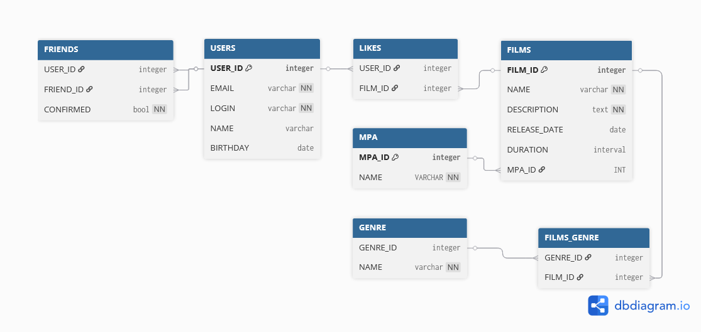

# java-filmorate
Template repository for Filmorate project.


# Filmorate Database

## Описание
Это база данных для приложения **java-filmorate** — сервиса для оценки фильмов и взаимодействия между пользователями.  
Пользователи могут добавлять фильмы, ставить лайки, дружить друг с другом.  
У фильмов есть жанры, рейтинг MPA и продолжительность.

---

##  Структура проекта

```
--> schema.sql # Описание структуры базы данных (DDL)
--> data.sql # Начальные тестовые данные (DML)
--> schema.png # ER-диаграмма базы данных
--> README.md # Описание проекта

```

## ️ Таблицы 

- **USERS** — пользователи сервиса
- **FILMS** — фильмы
- **GENRE** — жанры фильмов
- **FILMS_GENRE** — связь фильмов и жанров (многие-ко-многим)
- **FRIENDS** — дружба между пользователями
- **LIKES** — лайки пользователей к фильмам
- **MPA** — рейтинги MPA

## ER-диаграмма
